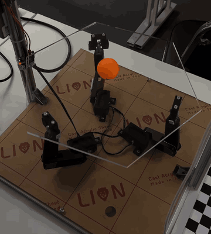
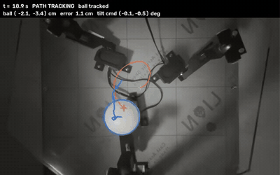

# Ball-Balancing Robot (3-DOF Parallel Platform)

Capstone Design Project, Mechatronics Engineering, Suranaree University of Technology (2026).
Team of 3. I was responsible for the wiring, assembly, and all software.



*Balance: the ball is pushed away with a stick and the plate brings it back.*

## What it does
A 3RRS platform tilts a plate to keep a ping-pong ball balanced at the center
and to move it along a circle or hexagon path.

| Demo | Result (tuned profiles, 2026-09-28) |
|---|---|
| Balance | Ball placed 5–9 cm from center is brought within 2 cm in about 0.5–5 s |
| Circle, 3 cm radius | Tracking error about 1.3–1.5 cm |
| Hexagon, 3.46 cm to corner | Tracking error about 1.4–2.1 cm |



*Circle path, seen by the control camera: orange circle is the reference, blue is the detected ball and its recent path.*

## How it works
```
Camera (OV9281, 30 fps) -> ball detection (OpenCV) -> alpha-beta velocity filter
-> LQR controller -> plate tilt angles -> calibrated tilt-to-servo mapping
-> servo commands over UART -> 3 x HX-35H servos
```
The tilt-to-servo mapping was measured on the real platform during calibration.
Inverse kinematics is computed every loop for comparison and display only; it does not drive the servos.

## Hardware
- Raspberry Pi 5 (Raspberry Pi OS, Python)
- OV9281 global-shutter camera, mounted above the plate
- 3 x Hiwonder HX-35H bus servos
- 3RRS mechanism with an acrylic plate and a 40 mm ping-pong ball

## Repository layout
```
docs/                     Handoff notes, demo instructions (Thai)
test_integrated_system/   Main control loop (main.py), controller, tracker, calibration, tests
ping_pong_tracker/        Camera and detector setup, calibration files
servo_*/                  Arduino sketches used for early servo tests
```

## Run the demo
See [docs/DEMO_RUN.md](docs/DEMO_RUN.md). Full project notes: [docs/HANDOFF.md](docs/HANDOFF.md).

Tests run without hardware:
```bash
python -m pytest test_integrated_system/tests
```

## Known limitations
- Stick-slip friction between the ball and the plate limits accuracy.
- The camera only sees about +/-8 cm from the center.
- Total loop delay is about 170 ms (camera, detection, command timing and servo response).
